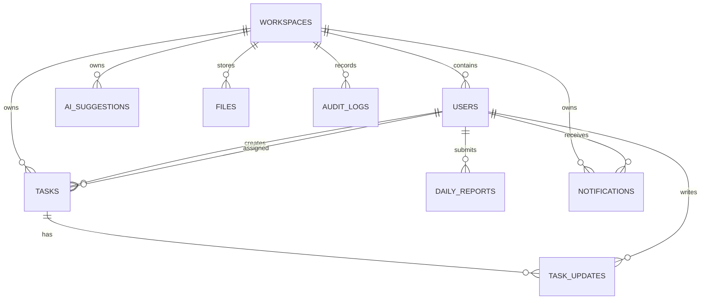

# Đặc Tả Sản Phẩm FOREP EXE

FOREP EXE - Nền tảng giao việc và quan sát nhân sự bằng AI cho doanh nghiệp nhỏ.

Phiên bản: 2.0  
Ngày cập nhật: 2026-06-24  
Mô hình mới: Workspace đơn giản, chỉ có OWNER và EMPLOYEE trong MVP.

## 1. Business Requirement Document

### Tầm nhìn sản phẩm

FOREP EXE giúp chủ doanh nghiệp nhỏ biết ai đang làm gì, ai đang quá tải, ai đang rảnh, việc nào trễ hạn, việc nào lâu chưa cập nhật và ai nên nhận công việc tiếp theo.

Sản phẩm dành cho:

- Doanh nghiệp nhỏ.
- Công ty gia đình.
- Cửa hàng bán lẻ.
- Agency nhỏ.
- Nhóm dịch vụ.
- Trung tâm đào tạo.
- Công ty nhỏ từ 1 chủ + 2 đến 30 nhân viên.

Những nhóm này thường giao việc bằng lời nói, Zalo, Messenger, điện thoại, giấy ghi chú hoặc Excel. Họ không có quy trình chính thức và không dùng Jira, Asana, ClickUp hay phần mềm enterprise.

### Giá trị cốt lõi

Không phải:

- Voice transcription.
- AI chatbot.
- Enterprise project management.
- Sprint, kanban, Jira, GitHub.

Đúng là:

- Giao việc.
- Theo dõi task.
- Nhìn rõ tiến độ.
- Cân bằng workload.
- AI gợi ý người nhận việc.
- AI tóm tắt tình hình kinh doanh.

### Nguyên tắc thiết kế

- Luồng dùng phải nhanh hơn Excel và giấy ghi chú.
- Chủ doanh nghiệp tạo việc và giao việc trong vài giây.
- Nhân viên chỉ cần thấy việc được giao và cập nhật tiến độ.
- Không có phân cấp nhóm, phòng ban, vai trò quản lý trung gian hoặc duyệt nhiều tầng.
- AI chỉ gợi ý, không tự giao việc.
- Voice không nằm trong MVP.

## 2. Functional Requirements

### Workspace

Workspace thay thế mô hình tổ chức phức tạp.

Ví dụ:

- Shop ABC
- Gia đình Nguyễn
- Agency XYZ

Trường dữ liệu:

- id
- name
- logo
- address
- owner_id
- created_at

Chức năng:

- Đăng ký workspace.
- Cập nhật tên, logo, địa chỉ.
- Owner là người sở hữu workspace.
- Mọi dữ liệu nghiệp vụ thuộc về một workspace.

### Người dùng

Chỉ có 2 role trong MVP:

- OWNER
- EMPLOYEE

OWNER:

- Tạo nhân viên.
- Tạo task.
- Giao task.
- Theo dõi workload.
- Xem và review báo cáo.
- Dùng gợi ý AI.

EMPLOYEE:

- Nhận task.
- Cập nhật tiến độ.
- Báo cáo blocker.
- Hoàn thành task.
- Gửi báo cáo hằng ngày.

Không có vai trò quản lý trung gian trong MVP.  
Không có vai trò phòng ban trong MVP.  
Không có SYSTEM_ADMIN trong MVP sản phẩm lõi.

### Task

Task là thực thể quan trọng nhất.

Trường dữ liệu:

- id
- workspace_id
- title
- requirements
- description
- assignee_id
- creator_id
- priority
- deadline
- estimated_hours
- progress_percent
- status
- created_at
- updated_at
- completed_at

Trường bắt buộc khi tạo task:

- Assignee.
- Title.
- Deadline.
- Requirements.

Status đơn giản:

- ASSIGNED
- IN_PROGRESS
- BLOCKED
- COMPLETED
- CANCELLED

Quy tắc:

- OWNER tạo và giao task.
- EMPLOYEE chỉ cập nhật task được giao cho mình.
- AI không tự assign.
- Task hoàn thành có progress_percent = 100.
- Task bị blocker phải có nội dung cập nhật.

### Task Update

Nhân viên có thể gửi:

- Progress update.
- Blocker update.
- Completion update.

Trường dữ liệu:

- id
- task_id
- user_id
- progress_percent
- content
- attachment
- update_type
- created_at

History phải được lưu.

### Daily Report

Nhân viên gửi báo cáo hằng ngày:

- Hôm nay đã hoàn thành gì.
- Đang làm gì.
- Vướng mắc.
- Kế hoạch ngày mai.

OWNER xem và review báo cáo.

### Workload Analytics

Đây là tính năng trọng tâm.

Với mỗi nhân viên hiển thị:

- Open tasks.
- In-progress tasks.
- Completed tasks.
- Overdue tasks.
- Estimated workload.

Mức workload:

- NO_WORK
- LOW
- NORMAL
- HIGH
- OVERLOADED

OWNER phải thấy ngay:

- Ai quá tải.
- Ai rảnh.
- Ai đang trễ tiến độ.
- Ai lâu chưa cập nhật.

### AI Feature 1: Gợi Ý Người Nhận Việc

Khi OWNER tạo task, hệ thống gợi ý nhân viên phù hợp.

Input:

- Task title.
- Requirements.
- Deadline.
- Estimated hours.

Hệ thống phân tích:

- Workload hiện tại.
- Open tasks.
- Overdue tasks.
- Employee availability.
- Missing updates nếu có.

Output:

- Danh sách nhân viên đề xuất.
- Lý do.
- Điểm phù hợp.
- Cảnh báo rủi ro.

Ví dụ:

1. Nguyễn Văn B  
   Lý do: Chỉ có 2 task đang mở.

2. Trần Thị C  
   Lý do: Không có task quá hạn.

AI không bao giờ tự assign. OWNER quyết định.

### AI Feature 2: Workload Summary

Sinh tóm tắt:

- Nhân viên quá tải nhất.
- Nhân viên rảnh nhất.
- Nhân viên có task quá hạn.
- Nhân viên thiếu cập nhật.

Ví dụ:

`Nhân viên A hiện có 12 task đang hoạt động và 3 task quá hạn.`

### AI Feature 3: Business Summary

Sinh:

- Daily Summary.
- Weekly Summary.
- Monthly Summary.

Ví dụ tuần:

- 43 task hoàn thành.
- 8 task quá hạn.
- 2 nhân viên quá tải.
- 4 nhân viên đang rảnh.

### AI Feature 4: Daily Report Insights

AI phân tích daily reports để tìm:

- Blocker đang lặp lại.
- Câu hỏi follow-up cho OWNER.
- Recommended actions cho team.

### AI Feature 5: Task Intelligence

AI hỗ trợ:

- Tạo task từ mô tả hoặc biên bản.
- Chia nhỏ task thành subtask có outcome rõ.
- Đề xuất đổi deadline/priority dựa trên overdue, blocked, progress thấp và deadline gần.

### AI Feature 6: Missing Reports và Action Suggestions

AI phát hiện nhân viên ACTIVE chưa gửi daily report và trả suggestion có:

- `actionType`.
- `targetEntityId`.
- `confidence` trong khoảng `0..1`.
- Lý do tiếng Việt nhất quán.

### Voice

Không thuộc MVP.

Chỉ triển khai sau khi core system hoạt động:

```text
Audio -> Transcript -> AI trích xuất task suggestion -> OWNER review -> Create task
```

Voice không bao giờ là bắt buộc.

## 3. User Stories

### OWNER

- Là OWNER, tôi muốn đăng ký workspace để bắt đầu quản lý công việc cho cửa hàng/công ty của mình.
- Là OWNER, tôi muốn tạo nhân viên để giao việc cho họ.
- Là OWNER, tôi muốn tạo task thật nhanh để không quên việc đã giao.
- Là OWNER, tôi muốn xem workload để biết ai quá tải và ai đang rảnh.
- Là OWNER, tôi muốn AI gợi ý người nhận việc để giao task hợp lý hơn.
- Là OWNER, tôi muốn xem task quá hạn để xử lý sớm.
- Là OWNER, tôi muốn xem báo cáo hằng ngày của nhân viên.
- Là OWNER, tôi muốn nhận summary hằng ngày/tuần/tháng.

### EMPLOYEE

- Là EMPLOYEE, tôi muốn xem task được giao để biết mình cần làm gì.
- Là EMPLOYEE, tôi muốn cập nhật tiến độ để chủ doanh nghiệp biết trạng thái.
- Là EMPLOYEE, tôi muốn báo blocker để được hỗ trợ.
- Là EMPLOYEE, tôi muốn đánh dấu hoàn thành task.
- Là EMPLOYEE, tôi muốn gửi báo cáo hằng ngày.

## 4. Database Schema

### workspaces

| Field | Type | Note |
| --- | --- | --- |
| id | uuid | Primary key |
| name | varchar | Tên workspace |
| logo | varchar | File/logo path |
| address | text | Địa chỉ đơn giản |
| owner_id | uuid | User owner |
| created_at | timestamp | Ngày tạo |

### users

| Field | Type | Note |
| --- | --- | --- |
| id | uuid | Primary key |
| workspace_id | uuid | Required |
| full_name | varchar | Required |
| email | varchar | Unique trong workspace |
| phone | varchar | Optional |
| password_hash | varchar | Required |
| role | enum | OWNER, EMPLOYEE |
| avatar | varchar | Optional |
| status | enum | ACTIVE, INACTIVE, INVITED |
| created_at | timestamp | Required |
| updated_at | timestamp | Required |

### tasks

| Field | Type | Note |
| --- | --- | --- |
| id | uuid | Primary key |
| workspace_id | uuid | Required |
| title | varchar | Required |
| requirements | text | Required |
| description | text | Optional |
| assignee_id | uuid | Required |
| creator_id | uuid | Required |
| priority | enum | LOW, MEDIUM, HIGH, CRITICAL |
| deadline | timestamp | Required |
| estimated_hours | numeric | Optional |
| progress_percent | integer | 0-100 |
| status | enum | ASSIGNED, IN_PROGRESS, BLOCKED, COMPLETED, CANCELLED |
| created_at | timestamp | Required |
| updated_at | timestamp | Required |
| completed_at | timestamp | Optional |

### task_updates

| Field | Type | Note |
| --- | --- | --- |
| id | uuid | Primary key |
| task_id | uuid | Required |
| user_id | uuid | Required |
| progress_percent | integer | 0-100 |
| content | text | Required |
| attachment | varchar | Optional |
| update_type | enum | PROGRESS, BLOCKER, COMPLETION |
| created_at | timestamp | Required |

### daily_reports

| Field | Type | Note |
| --- | --- | --- |
| id | uuid | Primary key |
| workspace_id | uuid | Required |
| user_id | uuid | Required |
| report_date | date | Required |
| today_completed | text | Required |
| current_work | text | Required |
| blockers | text | Optional |
| tomorrow_plan | text | Optional |
| reviewed_at | timestamp | Optional |
| created_at | timestamp | Required |
| updated_at | timestamp | Required |

### notifications

| Field | Type | Note |
| --- | --- | --- |
| id | uuid | Primary key |
| workspace_id | uuid | Required |
| user_id | uuid | Required |
| type | varchar | Required |
| title | varchar | Required |
| message | text | Required |
| related_entity_type | varchar | Optional |
| related_entity_id | uuid | Optional |
| is_read | boolean | Required |
| created_at | timestamp | Required |

### ai_suggestions

| Field | Type | Note |
| --- | --- | --- |
| id | uuid | Primary key |
| workspace_id | uuid | Required |
| type | enum | ASSIGNEE_RECOMMENDATION, WORKLOAD_SUMMARY, BUSINESS_SUMMARY, TASK_EXTRACTION, DAILY_REPORT_INSIGHTS, TASK_SPLIT, TASK_ADJUSTMENT, MISSING_REPORT, ACTION_SUGGESTION |
| input_data | jsonb | Required |
| output_data | jsonb | Required |
| status | enum | GENERATED, ACCEPTED, REJECTED |
| created_by | uuid | Required |
| created_at | timestamp | Required |

### files

| Field | Type | Note |
| --- | --- | --- |
| id | uuid | Primary key |
| workspace_id | uuid | Required |
| uploaded_by | uuid | Required |
| file_name | varchar | Required |
| file_type | varchar | Required |
| file_url | varchar | Required |
| related_entity_type | varchar | Optional |
| related_entity_id | uuid | Optional |
| created_at | timestamp | Required |

### audit_logs

| Field | Type | Note |
| --- | --- | --- |
| id | uuid | Primary key |
| workspace_id | uuid | Required |
| actor_id | uuid | Required |
| action | varchar | Required |
| entity_type | varchar | Required |
| entity_id | uuid | Required |
| old_value | jsonb | Optional |
| new_value | jsonb | Optional |
| created_at | timestamp | Required |

## 5. ERD



## 6. Backend APIs

### Auth và Workspace

- POST `/auth/login`
- POST `/auth/logout`
- GET `/auth/me`
- GET `/subscription-plans`
- POST `/workspace-registrations`
- PATCH `/workspace-registrations/{id}/payment`
- GET `/workspaces/current`
- PUT `/workspaces/current`

### Employees

- GET `/employees`
- POST `/employees`
- GET `/employees/{id}`
- PUT `/employees/{id}`
- PATCH `/employees/{id}/status`

### Tasks

- GET `/tasks`
- POST `/tasks`
- GET `/tasks/{id}`
- PUT `/tasks/{id}`
- PATCH `/tasks/{id}/assign`
- PATCH `/tasks/{id}/status`
- PATCH `/tasks/{id}/progress`
- PATCH `/tasks/{id}/cancel`

### Task Updates

- GET `/tasks/{id}/updates`
- POST `/tasks/{id}/updates`

### Daily Reports

- GET `/daily-reports`
- POST `/daily-reports`
- GET `/daily-reports/{id}`
- PATCH `/daily-reports/{id}/review`

### Analytics

- GET `/analytics/owner-dashboard`
- GET `/analytics/workload`
- GET `/analytics/employees/{id}/workload`

### AI

- POST `/ai/recommend-assignee`
- GET `/ai/workload-summary`
- GET `/ai/delay-risks`
- GET `/ai/daily-reports/insights`
- GET `/ai/daily-reports/missing`
- POST `/ai/tasks/extract`
- POST `/ai/tasks/{id}/split`
- POST `/ai/tasks/{id}/adjust`
- GET `/ai/action-suggestions`
- GET `/ai/suggestions`
- GET `/ai/business-summary/daily`
- GET `/ai/business-summary/weekly`
- GET `/ai/business-summary/monthly`

### Notifications

- GET `/notifications`
- PATCH `/notifications/{id}/read`
- PATCH `/notifications/read-all`

## 7. Frontend Pages

MVP pages:

1. Login.
2. Register Workspace.
3. Owner Dashboard.
4. Employee List.
5. Create Employee.
6. Task List.
7. Create Task.
8. Task Detail.
9. Update Progress.
10. Daily Report.
11. Workload Dashboard.
12. AI Recommendation Page.
13. Notifications.
14. Profile.

Không build:

- Team management.
- Quản lý phòng ban.
- Phân cấp tổ chức.
- Project management.
- Sprint management.
- Complex approval flows.
- Enterprise permissions.

## 8. Frontend Components

- AppLayout.
- OwnerSidebar.
- EmployeeSidebar.
- PageHeader.
- StatCard.
- TaskTable.
- TaskCard.
- EmployeeCard.
- WorkloadBadge.
- PriorityBadge.
- StatusBadge.
- ProgressBar.
- DailyReportForm.
- NotificationBell.
- AIRecommendationCard.
- WorkloadSummaryPanel.
- EmptyState.
- ConfirmDialog.
- FileUpload.

## 9. RBAC Rules

| Chức năng | OWNER | EMPLOYEE |
| --- | --- | --- |
| Đăng ký workspace | Có | Không |
| Sửa workspace | Có | Không |
| Tạo nhân viên | Có | Không |
| Sửa nhân viên | Có | Tự sửa hồ sơ cơ bản |
| Tạo task | Có | Không |
| Giao task | Có | Không |
| Xem tất cả task | Có | Không |
| Xem task được giao | Có | Có |
| Cập nhật tiến độ | Có | Có với task được giao |
| Hoàn thành task | Có | Có với task được giao |
| Xem workload toàn workspace | Có | Không |
| Xem dashboard cá nhân | Có | Có |
| Gửi daily report | Có nếu cần | Có |
| Review daily report | Có | Không |
| Dùng AI recommendation | Có | Không |

## 10. Dashboard Design

### Owner Dashboard

Cards:

- Tổng số task.
- Task đang hoạt động.
- Task hoàn thành.
- Task quá hạn.

Sections:

- Workload nhân viên.
- AI recommendations.
- Task trễ hạn.
- Task vừa cập nhật.

### Employee Dashboard

Hiển thị:

- Task được giao.
- Task quá hạn.
- Cập nhật tiến độ.
- Daily report.

## 11. AI Recommendation Logic

### Score gợi ý người nhận việc

```text
base_score = 100
- open_tasks * 6
- overdue_tasks * 12
- blocked_tasks * 8
- estimated_hours / 2
+ availability_bonus
```

Rule:

- Không đề xuất employee INACTIVE.
- Không được tự bịa employee ngoài danh sách input.
- Backend là nguồn quyết định eligibility, workloadLevel, score/candidateScore và ranking candidate.
- AI chỉ sinh reason/risk tiếng Việt từ candidate đã được backend lọc.
- Ưu tiên employee NO_WORK hoặc LOW.
- Nếu employee có overdue task thì giảm mạnh điểm.
- Nếu employee OVERLOADED thì chỉ hiển thị như cảnh báo, không xếp top.
- Không recommend người có overdue nặng nếu còn người khác phù hợp hơn.
- Risk phải xét overdue, blocked, progress thấp, deadline gần và workload cao.
- Nếu input employee rỗng thì trả list rỗng hợp lệ.
- Reason/risk phải là tiếng Việt nhất quán và giải thích được score.
- Output phải là JSON đúng schema, không markdown, không thêm field ngoài schema.

Output:

- employeeId
- fullName
- score
- workloadLevel
- reason
- risk

## 12. Notification Logic

Tạo thông báo khi:

- Task mới được giao.
- Deadline sắp đến.
- Task quá hạn.
- Task thiếu cập nhật.
- Daily report bị thiếu.

Notification phải có:

- title tiếng Việt.
- message tiếng Việt.
- related_entity_type.
- related_entity_id.
- is_read.

## 13. Development Roadmap

### Phase 1: MVP dùng được

- Auth.
- Register workspace.
- Employee management.
- Task CRUD.
- Task update history.
- Owner dashboard.
- Employee dashboard.
- Workload dashboard.
- Notifications cơ bản.

### Phase 2: AI giá trị cao

- AI assignee recommendation.
- AI workload summary.
- AI business summary daily/weekly/monthly.
- Missing update detection.
- Missing daily report detection.

### Phase 3: Voice sau cùng

- Upload audio.
- Transcript.
- AI task extraction.
- Owner review.
- Create task từ suggestion.
