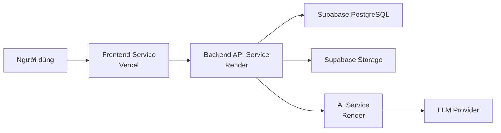
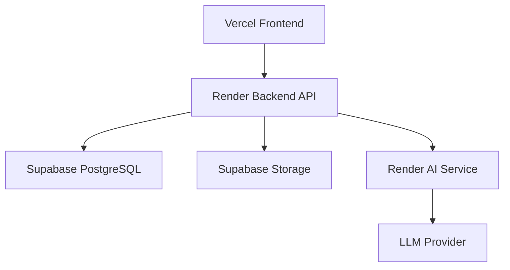

# FOREP EXE - Kiến Trúc SaaS MVP 3 Service

Mô hình bắt buộc:

```text
Frontend Service -> Backend API Service -> AI Service
```

Frontend không bao giờ gọi AI Service trực tiếp.

## 1. System Architecture

FOREP EXE là SaaS MVP cho chủ doanh nghiệp nhỏ biết:

- Ai đang làm gì.
- Ai quá tải.
- Ai đang rảnh.
- Task nào bị trễ.
- Ai nên nhận task tiếp theo.

Kiến trúc gồm 3 service:

1. Frontend Service: React UI cho OWNER và EMPLOYEE.
2. Backend API Service: Spring Boot API, auth, database, nghiệp vụ, RBAC, analytics, notification, tích hợp AI.
3. AI Service: service riêng cho gợi ý người nhận việc, workload summary, delay risk, daily summary và voice sau này.



## 2. Service Boundaries

### Frontend Service

Trách nhiệm:

- Owner Dashboard.
- Employee Dashboard.
- Task Management.
- Reports.
- Workload View.
- AI Recommendations UI.
- Notifications UI.

Không được:

- Gọi AI Service trực tiếp.
- Chứa business rule quan trọng.
- Quyết định phân quyền thật.

### Backend API Service

Trách nhiệm:

- Auth.
- Workspace.
- Employee Management.
- Task Management.
- Progress Tracking.
- Daily Reports.
- Notifications.
- Analytics.
- AI Integration.
- RBAC.
- Database access.
- Storage access.

Backend là service duy nhất frontend được gọi.

### AI Service

Trách nhiệm:

- Assignee Recommendation.
- Workload Summary.
- Delay Risk Detection.
- Daily Summary.
- Future Voice Processing.

AI Service không truy cập database trực tiếp trong MVP. Backend gửi input đã lọc quyền và nhận output có cấu trúc.

## 3. Folder Structure

```text
FOREP--V2/
  backend/
    src/main/java/com/forep/exe/
    Dockerfile
    .env.example
    pom.xml
  ai-service/
    app/
      main.py
      schemas.py
  docs/
    frontend-build-spec.md
      services.py
    Dockerfile
    requirements.txt
    .env.example
  docs/
  docker-compose.yml
  render.yaml
  .env.example
```

## 4. Database Schema

Database: Supabase PostgreSQL.

### workspaces

- id uuid primary key
- name varchar not null
- logo varchar
- address text
- owner_id uuid
- created_at timestamp

### users

- id uuid primary key
- workspace_id uuid references workspaces(id)
- full_name varchar not null
- email varchar not null
- phone varchar
- password_hash varchar not null
- role varchar not null
- avatar varchar
- status varchar not null
- created_at timestamp
- updated_at timestamp

### tasks

- id uuid primary key
- workspace_id uuid references workspaces(id)
- title varchar not null
- requirements text not null
- description text
- assignee_id uuid references users(id)
- creator_id uuid references users(id)
- priority varchar not null
- deadline timestamp not null
- estimated_hours numeric
- progress_percent int not null
- status varchar not null
- created_at timestamp
- updated_at timestamp
- completed_at timestamp

### task_updates

- id uuid primary key
- task_id uuid references tasks(id)
- user_id uuid references users(id)
- progress_percent int not null
- content text not null
- attachment varchar
- update_type varchar not null
- created_at timestamp

### daily_reports

- id uuid primary key
- workspace_id uuid references workspaces(id)
- user_id uuid references users(id)
- report_date date not null
- today_completed text not null
- current_work text not null
- blockers text
- tomorrow_plan text
- reviewed_at timestamp
- created_at timestamp
- updated_at timestamp

### notifications

- id uuid primary key
- workspace_id uuid references workspaces(id)
- user_id uuid references users(id)
- type varchar not null
- title varchar not null
- message text not null
- related_entity_type varchar
- related_entity_id uuid
- is_read boolean not null default false
- created_at timestamp

### ai_suggestions

- id uuid primary key
- workspace_id uuid references workspaces(id)
- type varchar not null
- input_data jsonb not null
- output_data jsonb not null
- status varchar not null
- created_by uuid references users(id)
- created_at timestamp

### files

- id uuid primary key
- workspace_id uuid references workspaces(id)
- uploaded_by uuid references users(id)
- file_name varchar not null
- file_type varchar not null
- file_url varchar not null
- related_entity_type varchar
- related_entity_id uuid
- created_at timestamp

### audit_logs

- id uuid primary key
- workspace_id uuid references workspaces(id)
- actor_id uuid references users(id)
- action varchar not null
- entity_type varchar not null
- entity_id uuid
- old_value jsonb
- new_value jsonb
- created_at timestamp

## 5. Backend APIs

Base path: `/api/v1`

Auth:

- POST `/auth/login`
- POST `/auth/logout`
- GET `/auth/me`

Workspace:

- POST `/workspaces/register`
- GET `/workspaces/current`
- PUT `/workspaces/current`

Employees:

- GET `/employees`
- POST `/employees`
- GET `/employees/{id}`
- PUT `/employees/{id}`
- PATCH `/employees/{id}/status`

Tasks:

- GET `/tasks`
- POST `/tasks`
- GET `/tasks/{id}`
- PUT `/tasks/{id}`
- PATCH `/tasks/{id}/assign`
- PATCH `/tasks/{id}/status`
- PATCH `/tasks/{id}/progress`
- PATCH `/tasks/{id}/cancel`

Task updates:

- GET `/tasks/{id}/updates`
- POST `/tasks/{id}/updates`

Reports:

- GET `/daily-reports`
- POST `/daily-reports`
- GET `/daily-reports/{id}`
- PATCH `/daily-reports/{id}/review`

Analytics:

- GET `/analytics/owner-dashboard`
- GET `/analytics/workload`
- GET `/analytics/employees/{id}/workload`

AI integration through backend:

- POST `/ai/recommend-assignee`
- GET `/ai/workload-summary`
- GET `/ai/delay-risks`
- GET `/ai/business-summary/daily`
- GET `/ai/business-summary/weekly`
- GET `/ai/business-summary/monthly`

Notifications:

- GET `/notifications`
- PATCH `/notifications/{id}/read`
- PATCH `/notifications/read-all`

## 6. AI APIs

AI Service internal base path: `/internal/ai`

Backend-only endpoints:

- POST `/internal/ai/recommend-assignee`
- POST `/internal/ai/workload-summary`
- POST `/internal/ai/delay-risks`
- POST `/internal/ai/daily-summary`
- POST `/internal/ai/voice/extract-tasks` future

Security:

- AI Service requires `X-Internal-Service-Token`.
- Frontend must not know AI service URL or token.

## 7. Frontend Pages

- Login.
- Register Workspace.
- Owner Dashboard.
- Employee Dashboard.
- Employee List.
- Create Employee.
- Task List.
- Create Task.
- Task Detail.
- Update Progress.
- Daily Report.
- Workload Dashboard.
- AI Recommendation Page.
- Notifications.
- Profile.

## 8. Frontend Components

- AppLayout.
- OwnerSidebar.
- EmployeeSidebar.
- PageHeader.
- StatCard.
- TaskTable.
- TaskForm.
- ProgressUpdateForm.
- DailyReportForm.
- EmployeeCard.
- WorkloadBadge.
- WorkloadChart.
- AIRecommendationCard.
- NotificationBell.
- EmptyState.
- ConfirmDialog.
- FileUpload.

## 9. RBAC

Only 2 MVP roles:

- OWNER.
- EMPLOYEE.

| Capability | OWNER | EMPLOYEE |
| --- | --- | --- |
| Register workspace | Yes | No |
| Manage workspace | Yes | No |
| Create employees | Yes | No |
| Create tasks | Yes | No |
| Assign tasks | Yes | No |
| View all tasks | Yes | No |
| View assigned tasks | Yes | Yes |
| Update assigned task progress | Yes | Yes |
| Submit daily report | Optional | Yes |
| Review daily reports | Yes | No |
| View workload dashboard | Yes | Own only |
| Request AI recommendations | Yes | No |

## 10. Deployment Architecture

Production:

- Frontend: Vercel.
- Backend API: Render Web Service.
- AI Service: Render Web Service.
- Database: Supabase PostgreSQL.
- Storage: Supabase Storage.



## 11. Docker Setup

Local Docker services:

- `frontend`: Vite preview or dev container.
- `backend`: Spring Boot API.
- `ai-service`: FastAPI AI service.
- `postgres`: local PostgreSQL for development.

Docker Compose file: [docker-compose.yml](../docker-compose.yml)

## 12. Local Development Setup

1. Copy `.env.example` to `.env`.
2. Copy backend/AI service env examples if needed:
   - `backend/.env.example` to `backend/.env`
   - `ai-service/.env.example` to `ai-service/.env`
3. Start backend, AI service, and database:

```bash
docker compose up --build
```

Local URLs:

- Backend: `http://localhost:8080`
- AI Service: `http://localhost:8000`
- PostgreSQL: `localhost:5432`

Front-end source code is no longer stored in this repo. Build the new UI from `docs/frontend-build-spec.md`; if it runs locally on another origin, set `CORS_ALLOWED_ORIGINS` for backend.

## 13. CI/CD Setup

Recommended GitHub Actions:

- Backend job: Maven test.
- AI job: Python dependency install and pytest.
- Deploy:
  - Render handles backend and AI service deploy from `render.yaml`.
  - Deploy the new front-end from its own project/folder after it is rebuilt from `docs/frontend-build-spec.md`.

Required CI checks:

- `backend`: `mvn test`
- `ai-service`: `pip install -r requirements.txt && python -m compileall app`

## 14. MVP Roadmap

### Phase 1

- Workspace registration.
- Auth.
- Employee management.
- Task creation and assignment.
- Progress updates.
- Owner dashboard.
- Employee dashboard.
- Workload dashboard.

### Phase 2

- Backend-to-AI assignee recommendation.
- Workload summary.
- Delay risk detection.
- Daily summary.
- Notification automation.

### Phase 3

- Supabase Storage file upload.
- Daily/weekly/monthly business summary.
- More complete audit logs.

### Phase 4

- Voice upload.
- Speech-to-text.
- AI task extraction from transcript.
- Owner review before task creation.

## Deployment Instructions

### Frontend: Vercel

Project settings:

- Root directory: use the new front-end project/folder created from `docs/frontend-build-spec.md`
- Build command: `npm run build`
- Output directory: `dist`
- Install command: `npm install`

Environment:

- `VITE_API_BASE_URL=https://forep-exe-backend.onrender.com/api/v1`

### Backend: Render

Service type: Web Service  
Root directory: `backend`  
Runtime: Docker or Java  
Health path: `/actuator/health` after actuator is added, or `/api/v1/auth/me` for MVP demo.

Environment:

- `DATABASE_URL`
- `DATABASE_USERNAME`
- `DATABASE_PASSWORD`
- `JWT_SECRET`
- `AI_SERVICE_URL`
- `AI_SERVICE_TOKEN`
- `SUPABASE_URL`
- `SUPABASE_SERVICE_ROLE_KEY`
- `SUPABASE_STORAGE_BUCKET`
- `CORS_ALLOWED_ORIGINS`

### Database: Supabase PostgreSQL

Use Supabase project database.

Backend JDBC format:

```text
jdbc:postgresql://<host>:5432/postgres
```

### AI Service: Render

Service type: Web Service  
Root directory: `ai-service`  
Runtime: Docker  
Health path: `/health`

Environment:

- `AI_SERVICE_TOKEN`
- `LLM_PROVIDER`
- `LLM_API_KEY`
- `LLM_MODEL`

### Storage: Supabase Storage

Create bucket:

- `forep-files`

Recommended policy:

- Private bucket.
- Backend creates signed URLs.
- Frontend never uploads directly in MVP unless signed upload is implemented.
